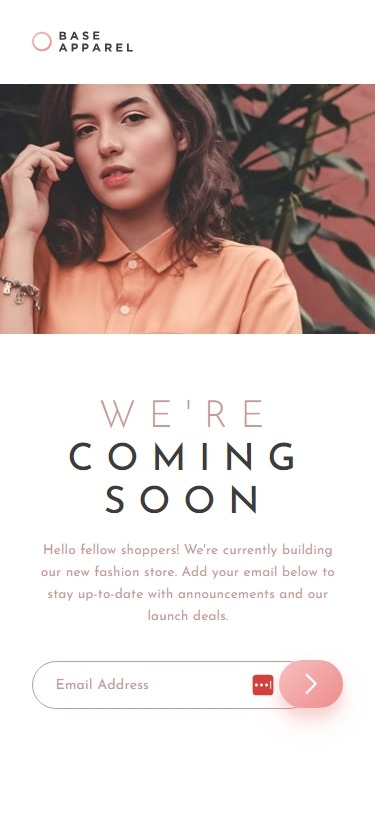

# Frontend Mentor - Base Apparel coming soon page solution

This is a solution to the [Base Apparel coming soon page challenge on Frontend Mentor](https://www.frontendmentor.io/challenges/base-apparel-coming-soon-page-5d46b47f8db8a7063f9331a0). Frontend Mentor challenges help you improve your coding skills by building realistic projects.

## Table of contents

- [Overview](#overview)
  - [The challenge](#the-challenge)
  - [Screenshot](#screenshot)
  - [Links](#links)
- [My process](#my-process)
  - [Built with](#built-with)
  - [What I learned](#what-i-learned)
  - [Useful resources](#useful-resources)
- [Author](#author)

## Overview

- Project start date: 11 March 2024
- Project duration: 03 Hours

### The challenge

Users should be able to:

- View the optimal layout for the site depending on their device's screen size
- See hover states for all interactive elements on the page
- Receive an error message when the `form` is submitted if:
  - The `input` field is empty
  - The email address is not formatted correctly

### Screenshot

| Desktop Version                         | Mobile Version                         |
| --------------------------------------- | -------------------------------------- |
|  |  |

### Links

- [Solution URL:](https://github.com/akmtasdikulislam/base-apparel-coming-soon)
- [Live Site URL:](https://akmtasdikulislam.github.io/base-apparel-coming-soon/)

## My process

- At first, I linked the `style.css` file and the Google Fonts CDN with `index.html`.
- Then, imported the colors from `style-guide.md` into the `style.css` file. After that, I initialized the css file and set necessary parameters (such as, font-families, colours, font-sizes, page backgound etc.) for this project.
- Then, I wrote necessary code to reach the given _UI Design Sample_ and also added necessary css styles to match it with the _UI Design Sample_.
- After that, I wrote the necessary CSS MEDIA QUERIES for mobile device view of this project.
- Finally, I wrote necessary `javascript` codes to validate email address when Submit button is **clicked**.

### Built with

- Semantic HTML5 markup
- CSS custom properties
- Flexbox

### What I learned

- How to use css `position: absolute;` for postioning elements.

### Useful resources

- [How to Do an Email Validation in JavaScript?](https://www.simplilearn.com/tutorials/javascript-tutorial/email-validation-in-javascript) - I got the email validation javascript `Regular Expression` here.

- [Understanding Sibling Selectors in CSS](https://www.browserstack.com/guide/sibling-selectors-in-css) - Here I learnt about the _Sibling Selectors in CSS_

- [100 CSS Box Shadow Examples](https://htmlcssfreebies.com/css-box-shadow-examples/) - Here I got the _box-shadow_ that I have used for the _Notify Me_ button

- [PerfectPixel by WellDoneCode](https://www.welldonecode.com/) - This helped me to match with the _UI Design Sample_.

## Author

- Frontend Mentor - [@akmtasdikulislam](https://www.frontendmentor.io/profile/akmtasdikulislam)
- Twitter - [@Akm_Tasdikul](https://www.twitter.com/Akm_Tasdikul)
